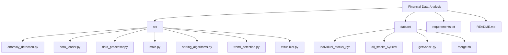

# Project - Stock Analyzer
## Overview
The project is designed to analyze stock datasets. The system detects patterns, trends, and anomalies using algorithms such as Kadane's and divide-and-conquer techniques to facilitate informed decision-making in finance.


## Installation:
#### Clone the repository:
```bash
git clone <repository-url>
cd <repository-directory>
```

#### Install the required libraries:
```bash
pip install -r requirements.txt
```

## Stock Growth and Max Profit Details

#### Stock Growth (%)

| Stock Symbol | Growth (%)  |
|--------------|-------------|
| AAPL         | 135.12%     |
| GOOGL        | 168.50%     |
| MSFT         | 225.26%     |
| AMZN         | 440.86%     |
| NVDA         | 1749.64%    |

#### Max Profit Details

| Stock Symbol | Max Profit ($) | Buy Day | Sell Day |
|--------------|----------------|---------|----------|
| AAPL         | 137314.97      | 0       | 1258     |
| GOOGL        | 858932.41      | 0       | 1258     |
| MSFT         | 64288.42       | 0       | 1258     |
| AMZN         | 726291.97      | 0       | 1258     |
| NVDA         | 70969.03       | 0       | 1258     |


### Visualization 


_Figure 1: Buy/Sell Best Opportunities_

### Methodology
The analysis is based on historical stock prices, allowing us to determine:
- **Buy Opportunity:** The optimal time to purchase a stock based on its historical lows before a subsequent rise.
- **Sell Opportunity:** The best time to sell a stock after experiencing a price increase.


_Figure 2: Stock Growth Over Time_


### Methodology
The stock growth analysis involves the following steps:
- **Data Collection:** Historical stock price data is collected, typically encompassing daily closing prices over a multi-year period.
- **Growth Calculation:** For each stock, the growth percentage is calculated using the formula:

#### Growth (%) = ((Ending Price - Starting Price) / Starting Price) × 100

This formula provides a clear indication of how much the stock's price has increased (or decreased) over the analyzed period.</br>
- **Comparison Across Stocks:** The calculated growth rates are then compared across multiple stocks to identify trends and patterns in performance.


_Figure 3: Anomaly Detection in Stock Prices_

### Methodology
- **Data Preprocessing:** The raw stock price data is cleaned and sorted chronologically.Moving averages are calculated to establish a baseline trend for detecting deviations.
- **Algorithm:** The system uses closest pair of points algorithm (based on divide-and-conquer). This approach analyzes stock prices over time, finding unusual deviations by comparing adjacent points with historical norms. The detection formula is:

#### Anomaly = |Price(t) - Moving Average(t)| > Threshold

- **Parameters:**
  - Threshold: A pre-defined or adaptive limit indicating the magnitude of change that qualifies as an anomaly.
#### Anomaly Detection:
- Significant spikes or drops in volume can indicate unusual activity, such as insider trading or news-related events.
#### Spikes and Dips:
- Red markers on the graph indicate anomalies—either sudden increases or drops in stock prices.
- These could correspond to breaking news, earnings reports, or other impactful events.
## Code Example

## Usage
To run the analysis, execute the main script:

```bash
python main.py
```

### Diagram



## Discussion of Findings

### Insights Gained
The analysis revealed several significant trends and anomalies in the stock data, highlighting how certain events in the market affect stock prices.

### Challenges Faced
Some challenges included:
- Ensuring the accuracy of anomaly detection algorithms.
- Handling missing data in the CSV files.

### Limitations
- The system currently only supports CSV files with specific column formats.
- More sophisticated anomaly detection techniques could be integrated for better accuracy.

### Suggestions for Improvement
- Expand support for other data formats (e.g., JSON).
- Enhance visualization capabilities with more interactive graphs.
- Implement machine learning models to predict stock price movements based on historical data.

